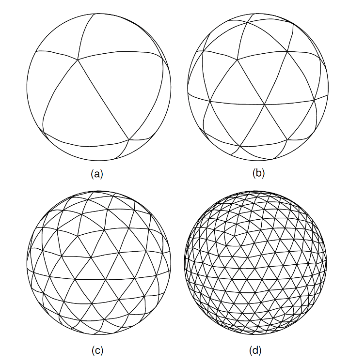

## TERRA
### The TERRA grid

The TERRA grid is based on a regular icosahedron projected onto a sphere. 
This defines twenty equal spherical triangles from the original 12 points. 
To generate a mesh of required resolution the midpoints of the three sides of each spherical triangle are connected using a great circle. 
This divides it into four sub triangles. 
This process can be repeated successively to get to the desired lateral resolution. 
Radially, TERRA nests these meshes vertically above each other to divide up the whole volume of the shell. 
The number of nested meshes is $(m/2)+1$, where $m$ is the number of sub-divisions along the side of an original triangle. 
These nested meshes are usually distributed uniformly radially from the inner to the outer shell. 
This is described in more detail in [@Baumgardner1985]. 

This means that at the kth refinement, there are $2 + 10m^2$ nodes, and $20m^2$ triangles, where $m = 2k$ in each layer mesh. There would be $m/2 + 1$ such layers nested radially. For example at the 6th refinement, $k=6$, $m=64$ – there are 81,920 triangles, and 40,962 nodes in each layer, and 33 layers – giving 1,351,746 nodes in total. 

The unknowns solved for in the mantle convection equations, i.e. dynamic pressure, mantle velocity and temperature, are solved on the nodes. Therefore, there are five unknowns at each node. 


This figure shows the original icosahedron, and three refinements from a to d. From [@Oldham2004].

### TERRA simulations
TERRA solves the equations for conservation of mass, momentum and energy in order to simulate mantle convection [Baumgerdner1985;@Bunge1995].
Simulations may be constrained by plate motion reconstructions as a surface velocity boundary condition [@Bunge2003], allowing them to be geo-reference to Earth. 
In order to track chemical information, TERRA makes use of tracer particles. 
These track absolute abundances of trace elements, for example the heat producing elements $^{40}K$, $^{232}Th$, $^{235}U$ and $^{238}U$, as well as a 1D value representing the bulk composition of a particle. 

## NetCDF File Format

Terratools has been written to accept TERRA's NetCDF file format, which is documented [here](https://github.com/mantle-convection-constrained/netcdf_versions). 
This format deviates slighlty from the standard NetCDF convention in that latitude and longitude are not dimensions of the dataset. 
We do this because the TERRA grid is not square, so converting to a lon/lat grid would result in a sparse matrix. 
Instead we use dimensions of 'depths' and 'nps'.
As the spherically projected icosahedral grid is repeated at each radial layer, grid points fall on the same latitude and longitude at each radial layers. 
The dimension 'depths' is therefore the size of the number of radial layers in the simulation and 'nps' is the number of grid points that are controlled by a process at each radial layer. 
The longitude and latitude of each 'nps' point is saved as a variable in the NetCDF file. 

All sumlation outputs, such as flow velocity, temperature, density, seismic velocities, are written out as variables with dimensions of (depths, nps), with the exception of the bulk composition (C), which has an extra 'compositions' dimension.
In the TERRA simulations, C is represented by a 1D value which varies between 0 and 1 (or 0 and 2 if the simulation includes primordial material). 
We can interpret the bulk composition value to represent a mechanical mixture of end-member components.
Nominmally these are harzburgite ($C=0$), lherzolite ($C=0.2$) and basaltic oceanic crust ($C=1$), with primordial ($C=2$) material being optional. 
This is the 'compositions' dimension of the 'composition\_fractions' variable.
At a tracer particle level, the particle will either be composed purely of one of the end-member compositions or a mixture of 2 of them. 
For example a particle which is of bulk composition $C=0.2$ would be composed of pure lherzolite, while a particle with a bulk composition of $C=0.6$ would be a mechanical mixture of 50% lherzolite and 50% basaltic oceanic crust. 
To get bulk compostion at the grid level, particle information is interpolated to the grid. 
In doing so we calculate the fraction of each end-member composition the comprises the bulk compositon of the grid cell. 
As the sum of composition fractions at each grid cell will always be equal to 1, we write out only $n-1$ fractions, where n is the number of end-member compositions that we consider.  
By convention, the end-member composition with the highest C value is not stored, but may be calculate by subtracting the sum of the other fractions at each grid point from 1. 
Below is an example file structure produced using the `ncdump -h` command from the NetCDF operators package. 

```
{
dimensions:
	depths = 65 ;
	nps = 1445 ;
	compositions = 2 ;
variables:
	float depths(depths) ;
		depths:units = "km" ;
		depths:radius = 6370. ;
	float velocity_x(depths, nps) ;
		velocity_x:units = "m/s" ;
	float velocity_y(depths, nps) ;
		velocity_y:units = "m/s" ;
	float velocity_z(depths, nps) ;
		velocity_z:units = "m/s" ;
	float temperature(depths, nps) ;
		temperature:units = "K" ;
	float density(depths, nps) ;
		density:units = "kg/m3" ;
	float viscosity(depths, nps) ;
		viscosity:units = "Pa s" ;
	float latitude(nps) ;
		latitude:units = "degrees" ;
	float longitude(nps) ;
		longitude:units = "degrees" ;
	float composition_fractions(compositions, depths, nps) ;
		composition_fractions:composition_1_name = "Harzburgite" ;
		composition_fractions:composition_1_c = 0. ;
		composition_fractions:composition_2_name = "Lherzolite" ;
		composition_fractions:composition_2_c = 0.2 ;
		composition_fractions:composition_3_name = "Basalt" ;
		composition_fractions:composition_3_c = 1. ;

// global attributes:
		:version = 1. ;
		:nth_comp = "bas_frac = 1 - hzb_frac - lhz_frac" ;
}
```
